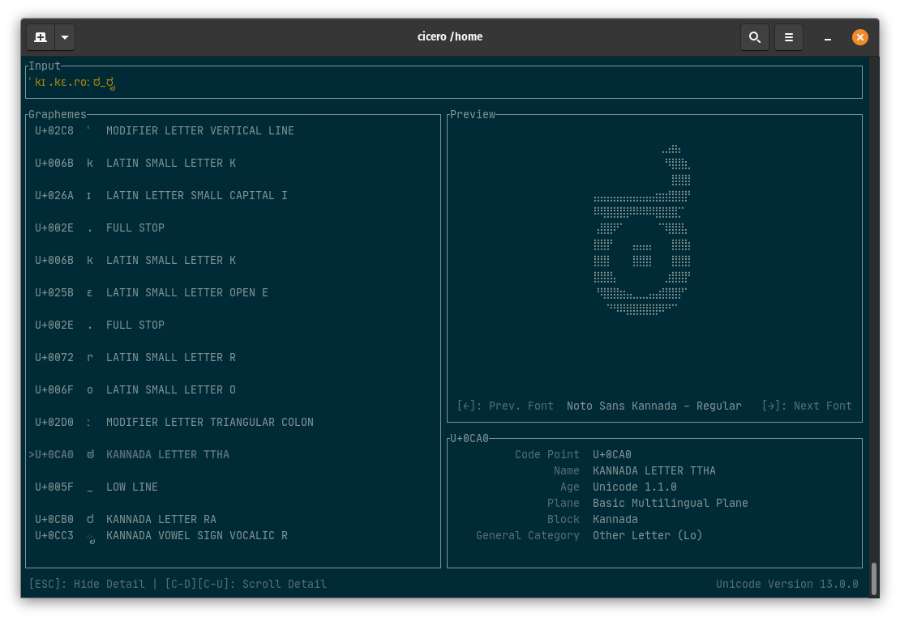

# cicero

Unicode tool with a terminal user interface.



## Usage

```
$ cicero -h
Cicero: A Unicode Tool 0.1.1 (Unicode Version 13.0.0)

USAGE:
    cicero [FLAGS] [OPTIONS] [INPUT]

FLAGS:
    -u               Parses INPUT as comma separated code points,
                     same as '--input-type=code-points',
                     ignored if '--input-type' is specified
    -h, --help       Prints help information
    -t, --tui        Shows Terminal UI
    -V, --version    Prints version information

OPTIONS:
    -i, --input-type <TYPE>         Specifies input type, 'string' by default,
                                    valid values: string, code-points
    -o, --output-format <FORMAT>    Specifies output format, 'text' by default,
                                    valid values: text, json

ARGS:
    <INPUT>    a string or comma separated code points
```

## Installation (homebrew tap)

The easiest way to install Cicero is via homebrew tap.

```sh
$ brew install eyeplum/tap/cicero-tui
```

Or alternatively:

```sh
$ brew tap eyeplum/tap
$ brew install cicero-tui
```

## Installation (AUR)

`cicero` can be installed from available [AUR packages](https://aur.archlinux.org/packages/?O=0&SeB=b&K=cicero&outdated=&SB=n&SO=a&PP=50&do_Search=Go) using an [AUR helper](https://wiki.archlinux.org/index.php/AUR_helpers). For example,

```sh
$ yay -S cicero
```

If you prefer, you can clone the [AUR packages](https://aur.archlinux.org/packages/?O=0&SeB=b&K=cicero&outdated=&SB=n&SO=a&PP=50&do_Search=Go) and then compile them with [makepkg](https://wiki.archlinux.org/index.php/Makepkg). For example,

```sh
$ git clone https://aur.archlinux.org/cicero.git
$ cd cicero
$ makepkg -si
```

## Installation (building from source)

You can also build Cicero from source.

### Supported Platforms

Cicero is tested on GNU/Linux, macOS, and Windows.

**Note:** Character preview is not available on Windows at the moment (I haven't been able to find an alternative for `fontconfig` on Windows), though it should work on Windows Subsystem for Linux.

### Rust

Make sure the latest stable Rust toolchain is installed. See [rustup](https://rustup.rs/).

### fontconfig and freetype

Cicero requires `fontconfig` and `freetype` libraries to build.

- On GNU/Linux (Tested on Ubuntu 18.04 LTS)

  ```sh
  # Assuming a C/C++ compiler and CMake are installed
  # This installs shared libraries for both fontconfig and freetype
  $ sudo apt install libfontconfig1-dev
  ```

- On macOS

  ```sh
  # Assuming homebrew is installed
  $ brew install pkg-config fontconfig
  ```

### Building

Building cicero should be as easy as:

```sh
$ git clone https://github.com/eyeplum/cicero-tui
$ cd cicero-tui
$ cargo build --release
$ ./target/release/cicero --version
Cicero: A Unicode Tool 0.1.0 (Unicode Version 13.0.0)
```

You could also copy the final product to somewhere in your `PATH`, for example:

```sh
$ cp target/release/cicero $HOME/.local/bin/
```

## License

[](https://www.gnu.org/licenses/gpl-3.0.html)
